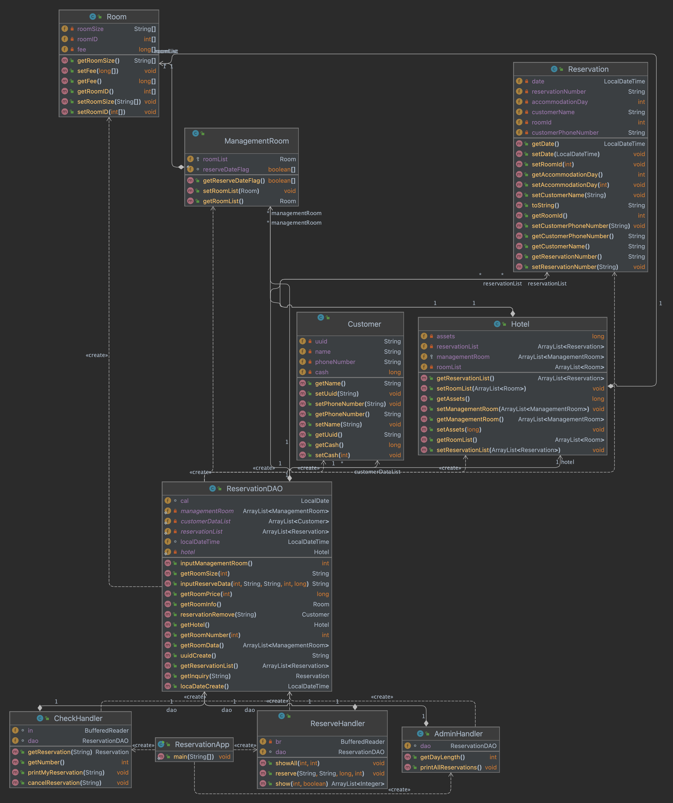

# 호텔 예약관리시스템 프로젝트

## 프로젝트 개요
 * 스파르타 코딩클럽 내일배움캠프 스프링_3기 자바 팀 과제 
 * 본 서비스를 이용하여 호텔 예약,조회,취소를 할 수 있다. 
 * CLI로 구현된 Service 

## 프로젝트 요구 명세서
* [프로젝트 요구 명세서](https://teamsparta.notion.site/Java-73b0f5b7e8944d34a49a325bd8619317)
## 팀원
* 최재석(팀장)
* 정성호 
* 장동하
* 권준혁

## :closed_book: STACKS
* JAVA

## :date:개발 기간
* 2023.10.24 ~ 27

## Diagram

## :camera:ScreenShots
### 메인
### 예약하기
### 예약확인
### 예약취소

## What We Learned
* [객체지향의 4가지 특성](https://www.codestates.com/blog/content/%EA%B0%9D%EC%B2%B4-%EC%A7%80%ED%96%A5-%ED%94%84%EB%A1%9C%EA%B7%B8%EB%9E%98%EB%B0%8D-%ED%8A%B9%EC%A7%95) 
* [응집도와 결합도](https://inpa.tistory.com/entry/OOP-%F0%9F%92%A0-%EA%B0%9D%EC%B2%B4%EC%9D%98-%EA%B2%B0%ED%95%A9%EB%8F%84-%EC%9D%91%EC%A7%91%EB%8F%84-%EC%9D%98%EB%AF%B8%EC%99%80-%EB%8B%A8%EA%B3%84-%EC%9D%B4%ED%95%B4%ED%95%98%EA%B8%B0-%EC%89%BD%EA%B2%8C-%EC%A0%95%EB%A6%AC) 
* [디자인 패턴](https://refactoring.guru/ko/design-patterns) 
* [객체지향 5가지 설계원칙 SOLID](https://mangkyu.tistory.com/194)
